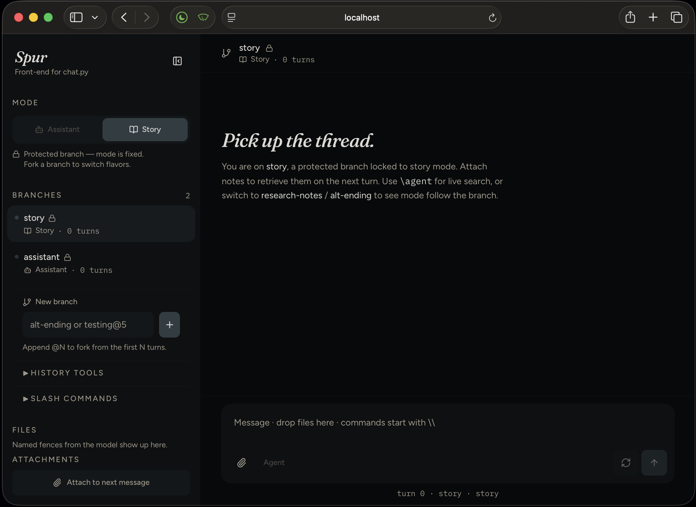

# Spur

A branched RAG chat UI. The engine is [`dynamic-rag-chat`](https://github.com/milljm/dynamic-rag-chat); this repo is only the view.



`spur-server.py` in that repo is the HTTP contract. Read it to learn the hooks (`/api/session`, `/api/branches*`, `/api/history*`, `/api/documents*`, `/api/chat` SSE). Spur talks to it over `VITE_CHAT_API`.

## Run

Two processes.

**1. Adapter** (from `dynamic-rag-chat`, same venv you already use):

```bash
uv run --with fastapi --with uvicorn spur-server.py
```

It loads `.chat.yaml`, so LM Studio / Ollama / keys are whatever the terminal app already uses. OpenAPI lives at `http://127.0.0.1:8765/docs`.

**2. UI** (this repo):

```bash
npm install
cp .env.example .env   # VITE_CHAT_API=http://127.0.0.1:8765
npm run dev
```

Open the address Vite prints.

Without `VITE_CHAT_API`, the UI is demo mode and never talks to your history.

## What you see

- **Mode / Branches / History / Slash** — the same rules as `chat.py` (`story` and `assistant` are protected).
- **Composer paperclip** — attach files *this turn*. After the turn they become Documents (assistant mode).
- **Documents** — whole files in `vector_dir/attachments/`. Mention a name to load it; the model can emit `<NEED_GOLD:file>` and Spur shows `Recalling Document… [README.md, …]`.
- **Downloadable Files** — named code fences on assistant messages still in this branch. Delete the turn, the download goes away.
- **Status** — `Working — RAG / agent / prompt…` → `Processing Prompt… [model] [route] [12.4k]` → `Streaming…` with the same quiet labels. Agent search and document recall get their own line.
- **Reasoning** — think-block text in a disclosure; visible answer streams below.

SSE events from the adapter: `status`, `token`, `reasoning`, `documents`, `usage`, `done`.

## What Spur does not own

History, RAG, the Documents cabinet, branch lock rules, agent tools, and `save_history` stay in `chat.py`. Do not copy `spur-server.py` here — it will drift. Edit the adapter next to `chat.py`.
